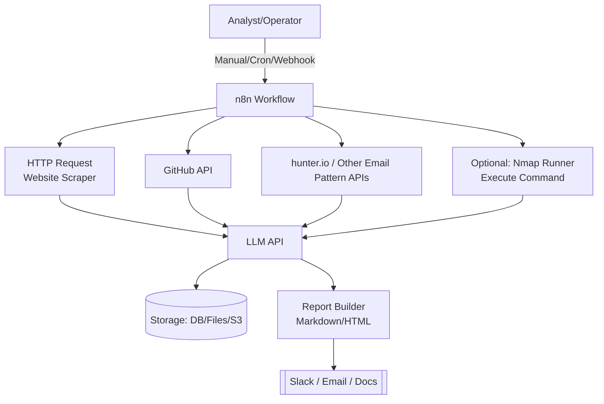
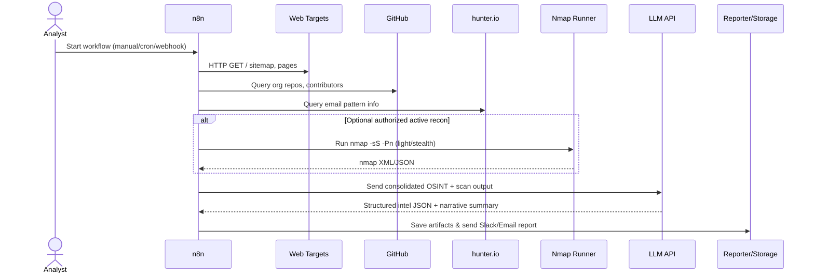

# LLM-Recon-Social-Engineering-Simulator

A low-code, end-to-end reconnaissance & social-engineering simulator built on n8n + an LLM API.
It orchestrates OSINT collection, synthesizes findings with an LLM, and generates training-safe simulated pretexts and intel reports—without you having to build a model from scratch.

## ⚠️ Ethics & Authorization

**This project is for defensive training, red-team exercises, and research on authorized targets only.** Respect platform ToS, robots.txt, and applicable laws. Do not run scans or active probes against systems you do not own or explicitly control with written permission.

## Table of Contents

- [LLM-Recon-Social-Engineering-Simulator](#llm-recon-social-engineering-simulator)
  - [⚠️ Ethics \& Authorization](#️-ethics--authorization)
  - [Table of Contents](#table-of-contents)
  - [Problem Statement](#problem-statement)
  - [Solution Overview](#solution-overview)
  - [Architecture](#architecture)
  - [Example Run (Sequence Diagram)](#example-run-sequence-diagram)
  - [Features](#features)
  - [What You'll Need](#what-youll-need)
  - [Quickstart (Local, Minimal)](#quickstart-local-minimal)
    - [1. Run n8n quickly (Docker)](#1-run-n8n-quickly-docker)
    - [2. Create credentials inside n8n:](#2-create-credentials-inside-n8n)
    - [3. Build the minimal workflow:](#3-build-the-minimal-workflow)
    - [4. Run once manually, check the result. Then add:](#4-run-once-manually-check-the-result-then-add)
  - [Workflow Stages](#workflow-stages)
    - [1) OSINT Collection](#1-osint-collection)
    - [2) Optional Active Recon (Authorized Only)](#2-optional-active-recon-authorized-only)
    - [3) LLM Intelligence Synthesis](#3-llm-intelligence-synthesis)
    - [4) Reporting \& Storage](#4-reporting--storage)
  - [LLM Prompt Templates](#llm-prompt-templates)
    - [System prompt (role):](#system-prompt-role)
    - [User prompt (structured extraction):](#user-prompt-structured-extraction)
    - [User prompt (narrative report):](#user-prompt-narrative-report)
  - [Outputs \& Reports](#outputs--reports)
    - [`/reports/`](#reports)
    - [`/artifacts/`](#artifacts)
  - [Roadmap](#roadmap)
  - [FAQ](#faq)
  - [Contributing](#contributing)
  - [License](#license)

## Problem Statement

Security teams struggle to practice social-engineering defense in a realistic, repeatable way:

- **OSINT overload**: Public data (websites, press releases, repos) is vast and noisy. Manually turning it into actionable intel is slow.
- **Pretext quality varies**: Drafting convincing (but safe) training scenarios is labor-intensive.
- **Inconsistent reporting**: Findings scatter across screenshots, notes, and spreadsheets—hard to compare over time.
- **Tooling complexity**: Stitching scanners, scrapers, and AI together typically requires custom code and infra.

We need a simple, low-code system that orchestrates OSINT, lets an LLM act as the analyst, and outputs clear, repeatable training materials and metrics.

## Solution Overview

This repo provides an n8n workflow that:

1. **Collects OSINT** (target website, GitHub org, email pattern services like hunter.io, etc.)
2. **Optionally performs light, authorized recon** (e.g., stealth `nmap -sS`)
3. **Sends raw signals to an LLM** via API to extract entities, infer patterns, and rank risks
4. **Generates safe training artifacts** (intel briefs, simulated pretexts, red-flag coaching notes)
5. **Delivers reports** to Slack/email and stores artifacts for an audit trail

You bring the n8n instance and an LLM API key (OpenAI, Anthropic, Azure OpenAI, etc.). No model training required.

## Architecture



**Images:**
- Add screenshots of your n8n editor or reports under `docs/images/` and reference them in the README, e.g.:
  - `docs/images/workflow-overview.png`
  - `docs/images/report-sample.png`

## Example Run (Sequence Diagram)



## Features

- **Low-code orchestration** entirely in n8n (HTTP, GitHub, Slack/Email, Execute Command).
- **LLM-as-Analyst**: Converts raw signals into structured intel and readable reports.
- **Training-safe pretexts**: Generates simulated emails/messages and red-flag notes for awareness training.
- **Metrics**: Produces a "susceptibility/coverage" snapshot per run (non-PII, training-oriented).
- **Modular**: Toggle optional steps (e.g., Nmap) without editing code.

## What You'll Need

- **n8n** (Docker or local install)
- **LLM API key** (OpenAI / Anthropic / Azure OpenAI / Cohere, etc.)
- **Optional service keys:**
  - hunter.io (email patterns)
  - GitHub PAT (for higher rate limits)
- **(Optional)** A safe, authorized environment to run light `nmap -sS` scans.

**Security Note:** Store secrets in n8n Credentials (not in plaintext). Use environment variables where possible.

## Quickstart (Local, Minimal)

### 1. Run n8n quickly (Docker)

```bash
docker run -it --rm \
  -p 5678:5678 \
  -e N8N_HOST=localhost \
  -e WEBHOOK_URL=http://localhost:5678/ \
  n8nio/n8n
```

### 2. Create credentials inside n8n:

- LLM (OpenAI/Anthropic/Azure OpenAI)
- Slack or SMTP for report delivery
- (Optional) GitHub, hunter.io

### 3. Build the minimal workflow:

**Manual Trigger** → **HTTP Request** (target homepage) → **(Optional) Execute Command** (nmap) → **LLM** (Summarize & Extract) → **Slack/Email** (send report)

### 4. Run once manually, check the result. Then add:

- HTML Extract for cleaner website parsing
- GitHub node for org repos
- hunter.io node (generic HTTP) for patterns
- Cron trigger for scheduled runs

## Workflow Stages

### 1) OSINT Collection

- **Website**: HTTP Request → HTML Extract (titles, meta, outbound links)
- **GitHub**: GitHub node → repos, README, contributors
- **Email patterns**: HTTP Request to hunter.io (or similar services)

**Notes:** Respect robots.txt and ToS. Rate-limit requests. Keep scope narrow.

### 2) Optional Active Recon (Authorized Only)

**Execute Command:**
```bash
nmap -sS -Pn -T2 --max-retries 2 -oX nmap.xml target.example.com && cat nmap.xml
```

Keep it light and approved. This project does not encourage aggressive scanning.

### 3) LLM Intelligence Synthesis

- Use the OpenAI (or generic HTTP) node.
- Feed the cleaned text + GitHub signals + (optional) Nmap XML.
- Request structured JSON + narrative summary (see prompt templates below).

### 4) Reporting & Storage

**Slack/Email** node to send a summary with key sections:
- Company overview & tech hints (with evidence/citations)
- Suppliers/partners mentioned publicly
- Email pattern hypothesis (with confidence)
- Optional: open ports/services (training context only)
- "Red flags to teach" (for awareness)

**Persist** raw artifacts in a bucket/DB (S3, SQLite, etc.) via n8n nodes.

## LLM Prompt Templates

### System prompt (role):
```
You are a cautious OSINT analyst producing training-safe intelligence for authorized defensive exercises. 
Extract facts conservatively; clearly separate evidence from inference; avoid speculative claims or personal data.
```

### User prompt (structured extraction):
```
From the following inputs (website text excerpts, GitHub metadata, email pattern signals, and optionally nmap XML),
return a JSON object with these fields:

{
  "company_overview": "...",
  "tech_stack": [{"technology":"", "evidence":"", "source":"url"}],
  "suppliers_partners": [{"name":"", "evidence":"", "source":"url"}],
  "email_patterns": [{"pattern":"firstname.lastname@domain.com", "confidence":0.0, "evidence":"hunter.io or examples"}],
  "potential_training_risks": [
    {"topic":"credential phishing", "reason":"", "public_clue":"", "defender_coaching":"red flags to teach"}
  ],
  "scan_observations_optional": [
    {"service":"443/tcp", "inference":"probable TLS endpoint", "risk_notes":"training context only"}
  ],
  "notes_on_uncertainty": "call out where evidence is weak"
}

INPUTS:
- WEBSITE: {{ $json.website_excerpt }}
- GITHUB: {{ $json.github_summary }}
- EMAIL SIGNALS: {{ $json.email_signals }}
- NMAP_XML (optional): {{ $json.nmap_xml }}
```

### User prompt (narrative report):
```
Write a concise training report (<= 800 words) with sections:
1) Executive Summary
2) Publicly-observable Context (with sources)
3) Likely Email Pattern(s) & Confidence
4) Awareness Training: What red flags to coach now
5) (Optional) Attack Surface Observations from light recon
6) Next Steps for Defenders
```

## Outputs & Reports

### `/reports/`
- `run-YYYYMMDD-HHMM-summary.md` – narrative report
- `run-YYYYMMDD-HHMM-intel.json` – structured intel

### `/artifacts/`
- `website-raw.json`, `github-raw.json`, `nmap.xml` (optional)

Embed screenshots under `docs/images/` (n8n nodes, Slack message, etc.) to showcase your setup.

## Roadmap

- [ ] Prebuilt n8n workflow JSON in `/workflows/osint-basic.json`
- [ ] Optional vishing simulator (scripted roleplay, no real calls)
- [ ] "Phish Susceptibility Index" (training-only metric)
- [ ] Simple web dashboard (read-only) for historical reports
- [ ] Red-team vs Blue-team exercise templates (playbooks)

## FAQ

**Do I have to write scripts?**  
No. Most is drag-and-drop. Add a small Code node only if you need custom parsing.

**Which apps should I connect first?**  
Start simple: HTTP Request, OpenAI (or your LLM), and Slack/Email. Add GitHub and hunter.io later.

**Can I run scans?**  
Only if authorized. Keep them light (stealth SYN, low timing) and training-oriented. This project defaults to passive OSINT.

**Do I need to train a model?**  
No. Bring an LLM API key; the LLM acts as the analyst.

## Contributing

Issues and PRs welcome! Please keep contributions defense-oriented, avoid aggressive techniques, and maintain clear boundaries around authorization and ethics.

## License

MIT (see [LICENSE](LICENSE)).
